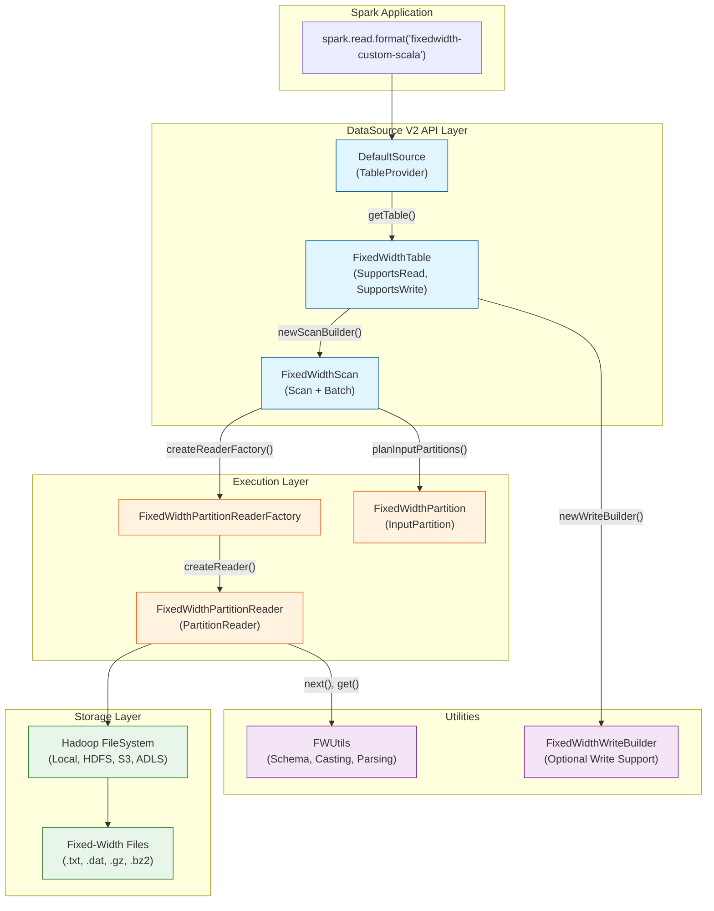
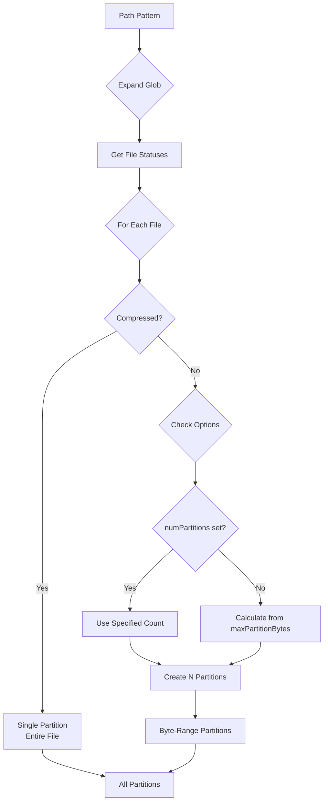
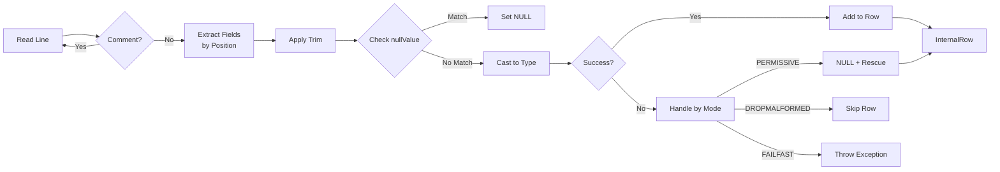
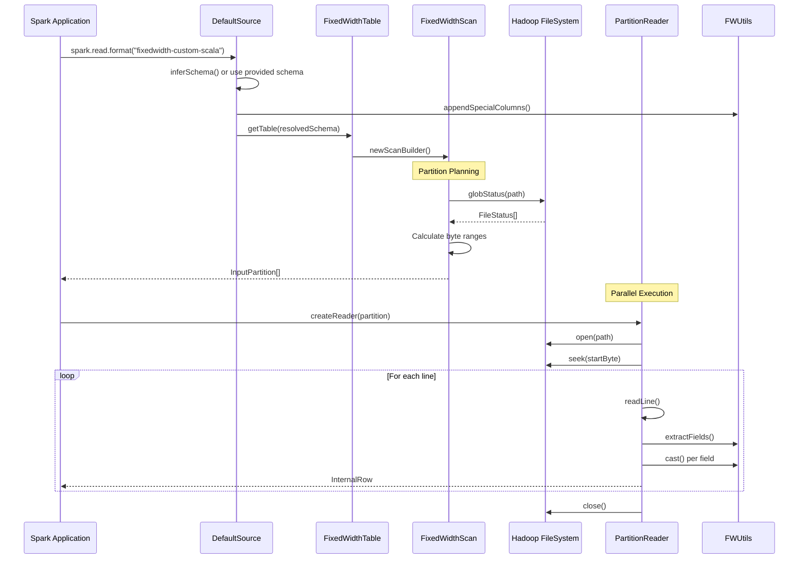
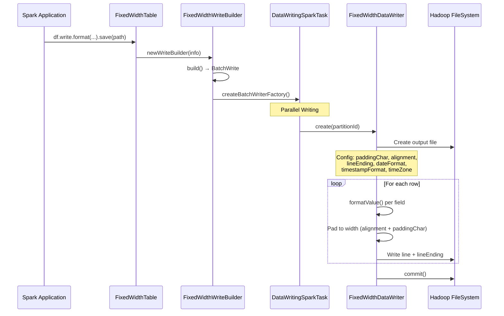
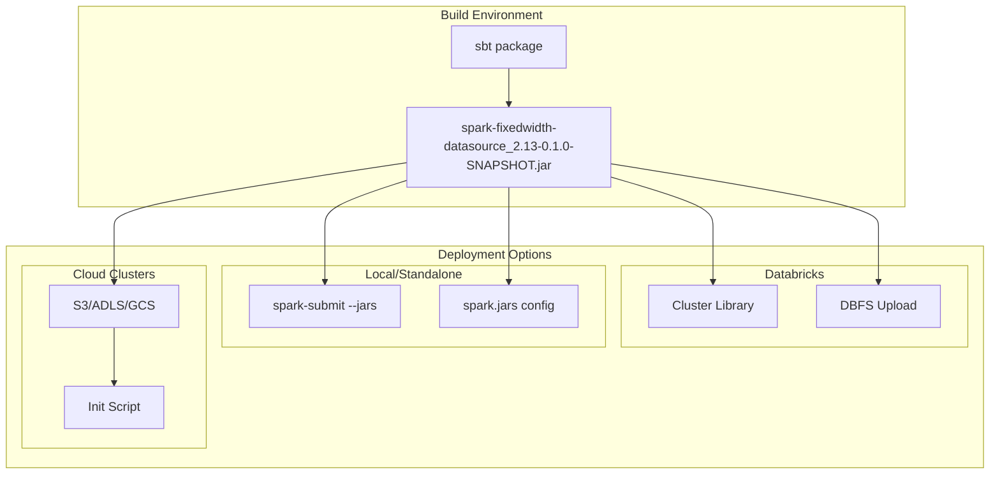
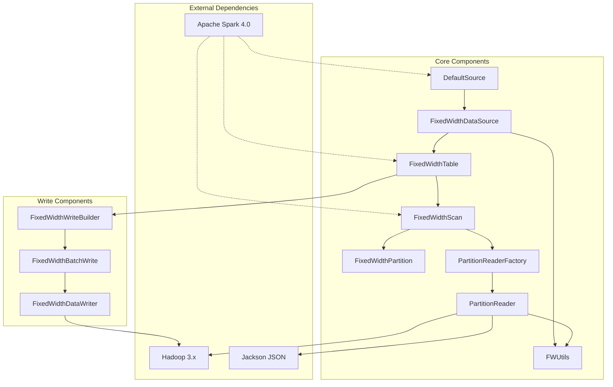

# System Architecture

## Overview

The **Spark Fixed-Width Data Source** is a custom Apache Spark Data Source V2 implementation that enables reading fixed-width formatted text files with full support for Spark's PERMISSIVE mode error handling. This document provides a comprehensive technical overview of the system architecture, component interactions, data flow, and design decisions.

> **Purpose**: Enable enterprise-grade fixed-width file processing in Spark 4.0+ environments (including Databricks) with exact CSV PERMISSIVE mode behavior for error handling, rescued data columns, and corrupt record tracking.

---

## High-Level Architecture



---

## Component Architecture

### 1. Entry Point Layer

#### DefaultSource.scala

| Property | Value |
|----------|-------|
| **Technology** | Scala 2.13, Spark DataSource V2 API |
| **Responsibilities** | ServiceLoader entry point, provider registration |
| **Key Dependencies** | `FixedWidthDataSource`, Java ServiceLoader |
| **Design Pattern** | Facade Pattern |

```scala
// Registered via META-INF/services/org.apache.spark.sql.sources.DataSourceRegister
class DefaultSource extends TableProvider with DataSourceRegister {
  override def shortName(): String = "fixedwidth-custom-scala"
}
```

**ServiceLoader Discovery Flow:**
```
META-INF/services/org.apache.spark.sql.sources.DataSourceRegister
    └── com.alexandertimmer.fixedwidth.DefaultSource
            └── shortName() = "fixedwidth-custom-scala"
```

---

#### FixedWidthDataSource.scala

| Property | Value |
|----------|-------|
| **Technology** | Spark DataSource V2 `TableProvider` API |
| **Responsibilities** | Schema inference, table creation, external metadata support |
| **Key Dependencies** | `FWUtils`, `FixedWidthTable` |
| **Design Pattern** | Factory Pattern |

**Key Methods:**

| Method | Purpose |
|--------|---------|
| `shortName()` | Returns `"fixedwidth-custom-scala"` for format registration |
| `supportsExternalMetadata()` | Returns `true` to accept user-provided schemas |
| `inferSchema(options)` | Infers base schema from `field_lengths` count |
| `getTable(schema, partitions, properties)` | Creates `FixedWidthTable` with resolved schema |

**Schema Resolution Strategy:**
```
User provides schema? ──┬── YES ──► Use user schema
                        │
                        └── NO ───► Call inferSchema()
                                         │
                                         ▼
                        appendSpecialColumns() applied to BOTH paths
                                         │
                                         ▼
                               Create FixedWidthTable(resolvedSchema)
```

---

### 2. Table Layer

#### FixedWidthTable.scala

| Property | Value |
|----------|-------|
| **Technology** | Spark `Table` with `SupportsRead` and `SupportsWrite` |
| **Responsibilities** | Define table capabilities, create scan/write builders |
| **Key Dependencies** | `FixedWidthScanBuilder`, `FixedWidthWriteBuilder` |
| **Design Pattern** | Builder Pattern |

**Capabilities:**
```scala
Set(
  TableCapability.BATCH_READ,      // Read in batches
  TableCapability.BATCH_WRITE,     // Write in batches
  TableCapability.ACCEPT_ANY_SCHEMA, // User schemas accepted
  TableCapability.TRUNCATE,        // Truncate on overwrite
  TableCapability.OVERWRITE_BY_FILTER,
  TableCapability.OVERWRITE_DYNAMIC
)
```

---

### 3. Scan Layer

#### FixedWidthScan.scala

| Property | Value |
|----------|-------|
| **Technology** | Spark `Scan` + `Batch` interfaces |
| **Responsibilities** | Partition planning, reader factory creation, glob expansion |
| **Key Dependencies** | `FixedWidthPartition`, `FixedWidthPartitionReaderFactory`, Hadoop FileSystem |
| **Design Pattern** | Strategy Pattern |

**Partition Planning Algorithm:**



**Key Options:**

| Option | Default | Description |
|--------|---------|-------------|
| `maxPartitionBytes` | 128MB | Maximum bytes per partition |
| `numPartitions` | Auto | Override: exact partition count |

---

### 4. Partition Layer

#### FixedWidthPartition.scala

| Property | Value |
|----------|-------|
| **Technology** | Spark `InputPartition` |
| **Responsibilities** | Represent byte range in a file |
| **Key Dependencies** | None (data class) |
| **Design Pattern** | Value Object |

```scala
case class FixedWidthPartition(
  path: String,        // File path (HDFS, S3, local)
  start: Long,         // Byte offset start (inclusive)
  length: Long,        // Byte length of partition
  isFirstSplit: Boolean // True if this is first partition (no line skip)
) extends InputPartition
```

**Byte-Based Partitioning:**
```
File: [═══════════════════════════════════════════════════]
      │ Partition 1  │ Partition 2  │ Partition 3  │ P4  │
      └─ 0-128MB ────┴─ 128-256MB ──┴─ 256-384MB ──┴─ ... ┘

Partition N (non-first): Seeks to byte offset, skips partial line, reads to byte limit + complete line
```

---

### 5. Reader Layer

#### FixedWidthPartitionReader.scala

| Property | Value |
|----------|-------|
| **Technology** | Spark `PartitionReader[InternalRow]`, Hadoop FS API |
| **Responsibilities** | Line parsing, field extraction, type conversion, error handling |
| **Key Dependencies** | `FWUtils`, Hadoop `FSDataInputStream`, Jackson JSON |
| **Design Pattern** | Iterator Pattern |

**Key Features:**

| Feature | Implementation |
|---------|----------------|
| **Compression Support** | Auto-detect via `CompressionCodecFactory` (gzip, bzip2, etc.) |
| **Charset Support** | Configurable encoding (default: UTF-8) |
| **Line Trimming** | Configurable leading/trailing whitespace removal |
| **Null Handling** | Custom `nullValue` option for NULL representation |
| **Date/Timestamp** | Custom format patterns with timezone support |
| **Comment Lines** | Skip lines starting with comment character |
| **Error Modes** | PERMISSIVE, DROPMALFORMED, FAILFAST |

**Row Processing Flow:**



---

#### FixedWidthPartitionReaderFactory.scala

| Property | Value |
|----------|-------|
| **Technology** | Spark `PartitionReaderFactory` (Serializable) |
| **Responsibilities** | Create partition readers with configuration |
| **Key Dependencies** | `FixedWidthPartitionReader` |
| **Design Pattern** | Factory Pattern |

**Serializable Configuration:**
```scala
case class FixedWidthPartitionReaderFactory(
  schema: StructType,
  fieldLengths: String,
  mode: String,
  skipLines: Int,
  encoding: String,
  rescuedDataColumn: Option[String],
  columnNameOfCorruptRecord: Option[String],
  ignoreLeadingWhiteSpace: Boolean,
  ignoreTrailingWhiteSpace: Boolean,
  nullValue: Option[String],
  dateFormat: Option[String],
  timestampFormat: Option[String],
  timeZone: Option[String],
  comment: Option[Char]
) extends PartitionReaderFactory with Serializable
```

---

### 6. Utilities Layer

#### FWUtils.scala

| Property | Value |
|----------|-------|
| **Technology** | Pure Scala utility functions |
| **Responsibilities** | Schema inference, type casting, position parsing, special column handling |
| **Key Dependencies** | Spark SQL Types, Java DateTime API |
| **Design Pattern** | Utility Module (Singleton Object) |

**Key Functions:**

| Function | Purpose |
|----------|---------|
| `parsePositions(opts)` | Parse `field_lengths` or `field_simple` to position tuples |
| `parseFieldSimple(widths)` | Convert width list to cumulative positions |
| `inferBaseSchema(opts)` | Create schema from field count |
| `appendSpecialColumns(schema, opts)` | Add `rescuedDataColumn` if needed |
| `cast(value, dataType, ...)` | Type conversion with format support |
| `isSpecial(name, rescued, corrupt)` | Check if column is special |
| `extractWidthsFromMetadata(schema)` | Get widths from `StructField` metadata |

**Type Casting Matrix:**

| Spark Type | Input | Output | On Failure |
|------------|-------|--------|------------|
| `StringType` | Any | String | N/A |
| `IntegerType` | "123" | 123 | NULL |
| `LongType` | "123456789" | 123456789L | NULL |
| `FloatType` | "12.34" | 12.34f | NULL |
| `DoubleType` | "12.34" | 12.34d | NULL |
| `BooleanType` | "true"/"false" | Boolean | NULL |
| `DateType` | "2025-01-15" | Date | NULL |
| `TimestampType` | "2025-01-15 10:30:00" | Timestamp | NULL |
| `DecimalType` | "123.45" | BigDecimal | NULL |

---

## Data Flow

### Read Path



### Write Path



---

## Deployment & Infrastructure

### Supported Environments

| Environment | Support Level | Notes |
|-------------|---------------|-------|
| **Databricks** | ✅ Full | Spark 4.0+, cluster library attachment |
| **Local PySpark** | ✅ Full | JAR via `--jars` or `spark.jars` |
| **Azure Synapse** | ✅ Compatible | Spark 4.0 pools |
| **AWS EMR** | ✅ Compatible | EMR 7.0+ (Spark 4.0) |
| **Google Dataproc** | ✅ Compatible | Dataproc 3.0+ |
| **Self-hosted** | ✅ Compatible | Any Spark 4.0.x cluster |

### Deployment Architecture



### Dependencies

```
spark-fixedwidth-datasource_2.13
├── org.apache.spark:spark-sql_2.13:4.0.0 (provided)
│   ├── org.apache.spark:spark-core_2.13
│   ├── org.apache.spark:spark-catalyst_2.13
│   └── org.apache.hadoop:hadoop-client
└── com.fasterxml.jackson.core:jackson-databind (transitive)
```

---

## Security Considerations

### Data Security

| Aspect | Implementation |
|--------|----------------|
| **File Access** | Inherits Hadoop FileSystem security (HDFS ACLs, S3 IAM, ADLS RBAC) |
| **Credentials** | No credential storage; uses Spark/Hadoop configuration |
| **Data in Transit** | Uses underlying filesystem encryption (HTTPS for cloud storage) |
| **Data at Rest** | Supports reading encrypted files via Hadoop transparent encryption |

### Input Validation

| Validation | Location | Protection |
|------------|----------|------------|
| Option parsing | `FWUtils.parsePositions()` | Malformed `field_lengths` rejected |
| Schema validation | `getTable()` | Invalid schemas rejected |
| File path validation | `FixedWidthScan` | Glob expansion via Hadoop API |
| Type conversion | `FWUtils.cast()` | Safe parsing with NULL fallback |

### Audit & Compliance

- **File Path Tracking**: `_file_path` included in rescued data JSON
- **Error Tracking**: Malformed data captured in `_corrupt_record` or `_rescued_data`
- **No PII Handling**: Library is data-agnostic; compliance is application responsibility

---

## Scalability & Performance

### Performance Characteristics

| Metric | Characteristic |
|--------|----------------|
| **Time Complexity** | O(n) where n = total bytes across files |
| **Space Complexity** | O(partition size) per executor |
| **Parallelism** | Linear scaling with partition count |
| **I/O Pattern** | Sequential reads with byte-range seeking |

### Scalability Features

| Feature | Implementation | Benefit |
|---------|----------------|---------|
| **Byte-Based Partitioning** | Files split by byte offset | True parallel I/O |
| **Lazy Evaluation** | Iterator-based reader | Memory bounded |
| **Glob Expansion** | Multi-file support | Batch processing |
| **Compression Support** | Codec auto-detection | Storage efficiency |

### Optimization Recommendations

```
File Size → Partition Strategy
─────────────────────────────
< 128MB   : Single partition (overhead > benefit)
128MB-1GB : Default auto-partitioning (128MB splits)
> 1GB     : Consider numPartitions for control
> 10GB    : Ensure cluster has adequate executors

maxPartitionBytes tuning:
- Increase: Reduce task overhead, need more memory
- Decrease: Better parallelism, more task scheduling overhead
```

---

## Known Limitations

### Current Bottlenecks

| Limitation | Impact | Workaround |
|------------|--------|------------|
| **Compressed files cannot be split** | Single partition for .gz files | Use uncompressed or splittable codecs (bzip2 is not; lz4 is) |
| **No push-down predicates** | Full file scan always | Pre-filter at storage level |
| **Schema evolution** | Schema must match file structure | Version schemas explicitly |

### Technical Debt Areas

| Area | Issue | Priority |
|------|-------|----------|
| **CRLF byte counting** | `readNextLine()` uses `+1` for newline byte; should use actual byte length for CRLF accuracy | Low |
| **Metadata columns** | `_file_path` only in rescued JSON | Medium |
| **Statistics** | No file-level statistics collection | Low |

---

## Future Improvements

### Planned Architecture Changes

| Enhancement | Description | Complexity |
|-------------|-------------|------------|
| **Column Pruning** | Read only requested columns | Medium |
| **Predicate Pushdown** | Filter rows during parsing | High |
| **Schema Evolution** | Handle changing file formats | Medium |
| **Streaming Support** | `SupportsStreaming` interface | High |

### Migration Strategies

**Upgrading from DataSource V1:**
```
V1 API (deprecated)           V2 API (current)
────────────────────────────────────────────────
RelationProvider      →       TableProvider
BaseRelation          →       Table
InputFormat           →       PartitionReader
OutputFormat          →       DataWriter
```

**Spark Version Compatibility:**
```
Spark Version    Support
─────────────────────────
3.x              Not compatible (V2 API differences)
4.0.x            ✅ Full support
4.1.x            Expected compatible (test when released)
```

---

## Component Dependency Graph



---

## References

- [Spark DataSource V2 Guide](https://spark.apache.org/docs/latest/sql-data-sources.html)
- [Spark Connector Development](https://spark.apache.org/docs/latest/sql-data-sources-developer-guide.html)
- [Hadoop FileSystem API](https://hadoop.apache.org/docs/current/api/org/apache/hadoop/fs/FileSystem.html)
- [Project Feature Roadmap](FEATURE_ROADMAP.md)
- [API Reference](API_REFERENCE.md)
- [Configuration Guide](CONFIGURATION.md)
