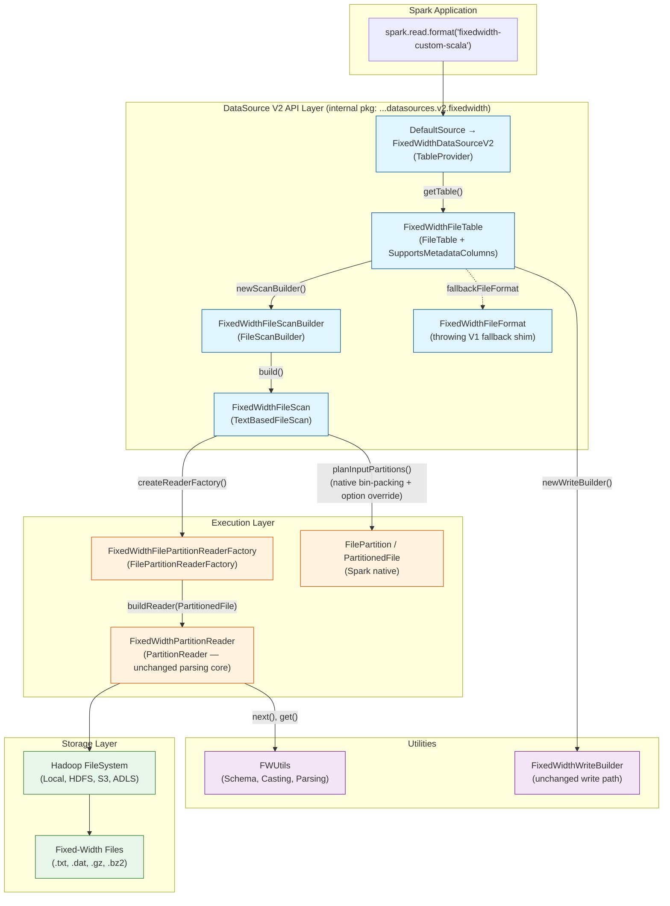
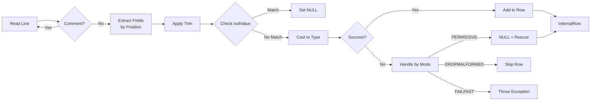
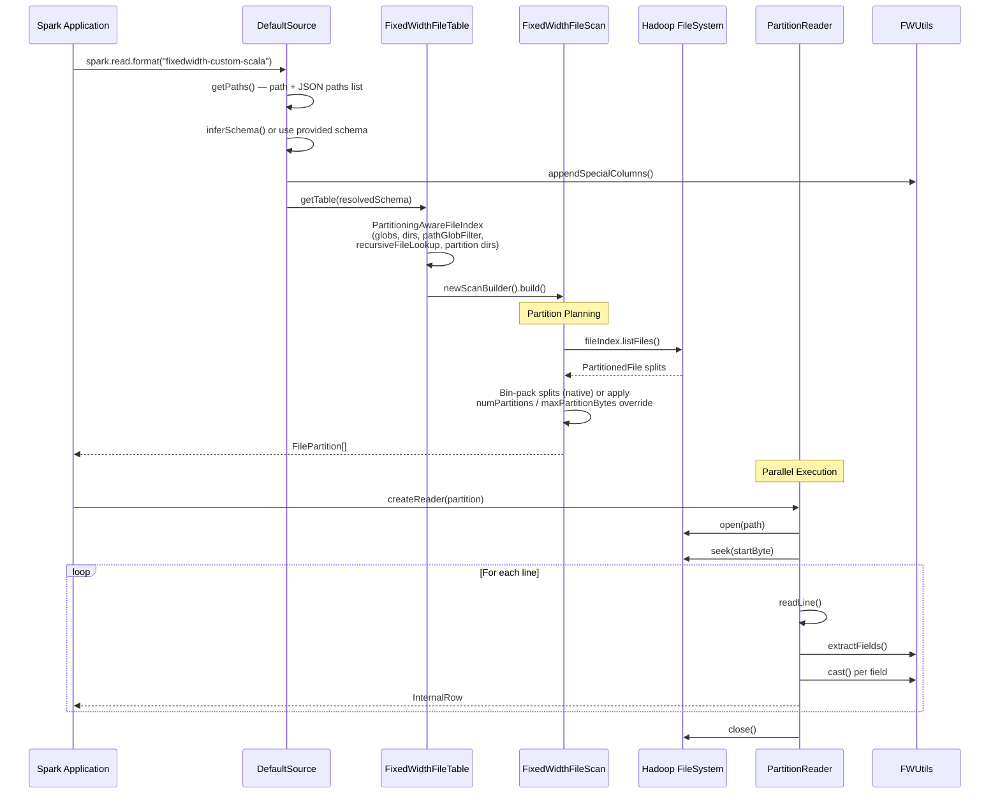
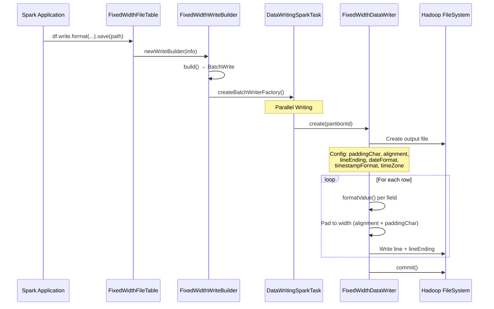
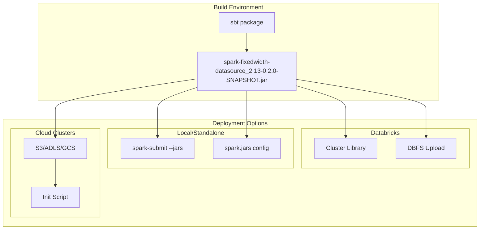
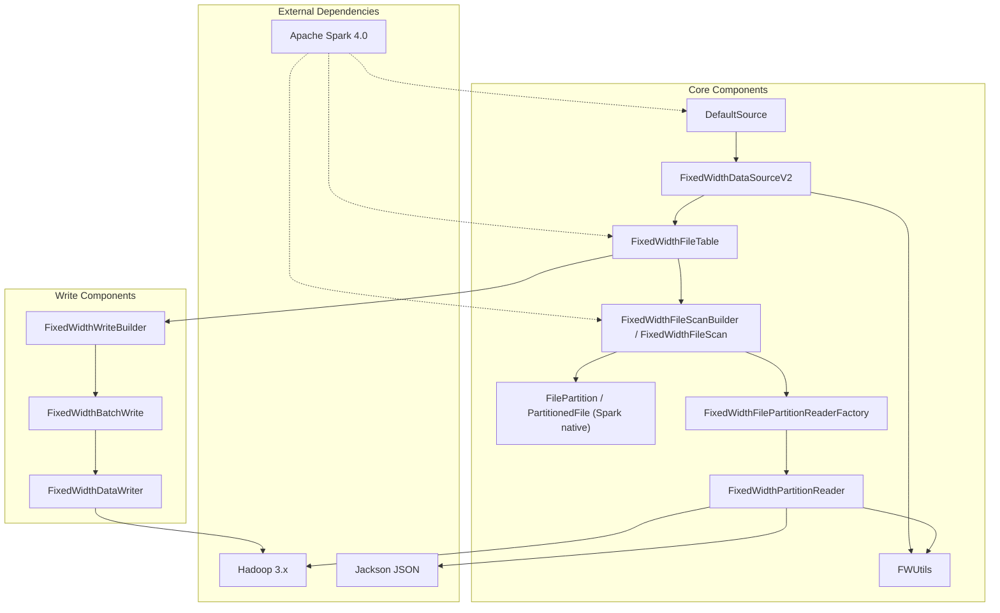

# System Architecture

## Overview

The **Spark Fixed-Width Data Source** is a custom Apache Spark Data Source V2 implementation that enables reading fixed-width formatted text files with full support for Spark's PERMISSIVE mode error handling. This document provides a comprehensive technical overview of the system architecture, component interactions, data flow, and design decisions.

> **Purpose**: Enable enterprise-grade fixed-width file processing in Spark 4.0+ environments (including Databricks) with exact CSV PERMISSIVE mode behavior for error handling, rescued data columns, and corrupt record tracking.

---

## High-Level Architecture

Since v0.2.0 the read path is built on **Spark's native FileScan machinery**
(the same foundation as the built-in CSV/JSON/Text sources): file discovery
runs through a `PartitioningAwareFileIndex`, partition planning through
`FilePartition` bin-packing, and per-file reading through
`FilePartitionReaderFactory`. This provides explicit multi-path loads
(`.load(f1, f2, ...)`), cross-file bin-packing for many small files,
`input_file_name()` / `_metadata` provenance, `pathGlobFilter`,
`recursiveFileLookup` and Hive-style partition-directory inference — while the
battle-tested per-line parsing core (`FixedWidthPartitionReader`, `FWUtils`)
and the entire write path are unchanged.

The FileScan-derived classes live in the
`org.apache.spark.sql.execution.datasources.v2.fixedwidth` package because
they extend `private[sql]` Spark internals — the same technique the built-in
sources use. The parsing/writing core remains in
`com.alexandertimmer.fixedwidth`.


```mermaid
flowchart TB
    subgraph SparkApp["Spark Application"]
        Client["spark.read.format('fixedwidth-custom-scala')"]
    end

    subgraph DSV2["DataSource V2 API Layer (internal pkg: ...datasources.v2.fixedwidth)"]
        DS["DefaultSource →<br/>FixedWidthDataSourceV2<br/>(TableProvider)"]
        Table["FixedWidthFileTable<br/>(FileTable + SupportsMetadataColumns)"]
        Builder["FixedWidthFileScanBuilder<br/>(FileScanBuilder)"]
        Scan["FixedWidthFileScan<br/>(TextBasedFileScan)"]
        Shim["FixedWidthFileFormat<br/>(throwing V1 fallback shim)"]
    end

    subgraph Execution["Execution Layer"]
        Factory["FixedWidthFilePartitionReaderFactory<br/>(FilePartitionReaderFactory)"]
        Partition["FilePartition / PartitionedFile<br/>(Spark native)"]
        Reader["FixedWidthPartitionReader<br/>(PartitionReader — unchanged parsing core)"]
    end

    subgraph Utils["Utilities"]
        FWUtils["FWUtils<br/>(Schema, Casting, Parsing)"]
        Write["FixedWidthWriteBuilder<br/>(unchanged write path)"]
    end

    subgraph Storage["Storage Layer"]
        FS["Hadoop FileSystem<br/>(Local, HDFS, S3, ADLS)"]
        Files["Fixed-Width Files<br/>(.txt, .dat, .gz, .bz2)"]
    end

    Client --> DS
    DS -->|"getTable()"| Table
    Table -.->|"fallbackFileFormat"| Shim
    Table -->|"newScanBuilder()"| Builder
    Builder -->|"build()"| Scan
    Scan -->|"planInputPartitions()<br/>(native bin-packing + option override)"| Partition
    Scan -->|"createReaderFactory()"| Factory
    Factory -->|"buildReader(PartitionedFile)"| Reader
    Reader -->|"next(), get()"| FWUtils
    Reader --> FS
    FS --> Files
    Table -->|"newWriteBuilder()"| Write

    classDef api fill:#e1f5fe,stroke:#01579b
    classDef exec fill:#fff3e0,stroke:#e65100
    classDef util fill:#f3e5f5,stroke:#7b1fa2
    classDef storage fill:#e8f5e9,stroke:#2e7d32

    class DS,Table,Builder,Scan,Shim api
    class Factory,Partition,Reader exec
    class FWUtils,Write util
    class FS,Files storage
```

---

## Component Architecture

### 1. Entry Point Layer

#### DefaultSource.scala

| Property | Value |
|----------|-------|
| **Technology** | Scala 2.13, Spark DataSource V2 API |
| **Responsibilities** | ServiceLoader entry point, provider registration |
| **Key Dependencies** | `FixedWidthDataSourceV2`, Java ServiceLoader |
| **Design Pattern** | Facade Pattern |

```scala
// Registered via META-INF/services/org.apache.spark.sql.sources.DataSourceRegister
class DefaultSource extends FixedWidthDataSourceV2
```

**ServiceLoader Discovery Flow:**
```
META-INF/services/org.apache.spark.sql.sources.DataSourceRegister
    └── com.alexandertimmer.fixedwidth.DefaultSource
            └── shortName() = "fixedwidth-custom-scala"
```

---

#### FixedWidthDataSourceV2.scala (internal package)

| Property | Value |
|----------|-------|
| **Technology** | Spark DataSource V2 `TableProvider` API |
| **Responsibilities** | Path-list resolution (`path` + JSON `paths`), table creation, external metadata support |
| **Key Dependencies** | `FWUtils`, `FixedWidthFileTable` |
| **Design Pattern** | Factory Pattern |

**Key Methods:**

| Method | Purpose |
|--------|---------|
| `shortName()` | Returns `"fixedwidth-custom-scala"` for format registration |
| `supportsExternalMetadata()` | Returns `true` to accept user-provided schemas |
| `getPaths(options)` | Decodes the JSON `paths` option (from `.load(f1, f2, ...)`) plus the singular `path` — mirroring `FileDataSourceV2` |
| `inferSchema(options)` | Base schema from `field_lengths`/`field_simple` + special columns |
| `getTable(schema, partitions, properties)` | Creates `FixedWidthFileTable` with resolved schema |

> **Design note (SPARK-28396):** the provider implements `TableProvider`
> directly and deliberately does NOT extend Spark's `FileDataSourceV2`
> interface: `DataFrameWriter` unconditionally routes `FileDataSourceV2`
> sources to the V1 write path (`fallbackFileFormat`), which would bypass
> this source's existing V2 write path. Implementing `TableProvider` keeps
> `df.write.save(...)` on the unchanged `FixedWidthWriteBuilder`.

**Schema Resolution Strategy (unchanged contract):**
```
User provides schema? ──┬── YES ──► Use user schema
                        │
                        └── NO ───► Infer from field_lengths / field_simple
                                         │
                                         ▼
                        appendSpecialColumns() applied to BOTH paths
                        (_corrupt_record: only if already present;
                         rescuedDataColumn: auto-appended when option set)
                                         │
                                         ▼
                             Create FixedWidthFileTable(resolvedSchema)
```

---

### 2. Table Layer

#### FixedWidthFileTable.scala (internal package)

| Property | Value |
|----------|-------|
| **Technology** | Spark `FileTable` (native file-source machinery) + `SupportsMetadataColumns` |
| **Responsibilities** | File discovery via `PartitioningAwareFileIndex`, schema composition, `_metadata` declaration, scan/write builder creation |
| **Key Dependencies** | `FixedWidthFileScanBuilder`, `FixedWidthWriteBuilder`, `FixedWidthFileFormat` |
| **Design Pattern** | Builder Pattern |

`FileTable` supplies globbing, directory expansion, hidden-file filtering
(`_`/`.` prefixes), `pathGlobFilter`, `recursiveFileLookup` and Hive-style
partition-directory inference. Two deliberate specializations:

- **Write-safe schema resolution**: `FileTable`'s file index requires paths to
  exist; because this source also serves `df.write.save(newPath)` through the
  V2 path, schema resolution falls back to the options/user schema when the
  location does not exist yet (reads of missing paths still fail loudly).
- **`_metadata` column**: declared via `SupportsMetadataColumns` with the same
  struct shape as Spark's file sources (`file_path`, `file_name`, `file_size`,
  `file_block_start`, `file_block_length`, `file_modification_time`).

**Capabilities (unchanged):**
```scala
Set(
  TableCapability.BATCH_READ,      // Read in batches
  TableCapability.BATCH_WRITE,     // Write in batches
  TableCapability.ACCEPT_ANY_SCHEMA, // User schemas accepted
  TableCapability.TRUNCATE,        // Truncate on overwrite
  TableCapability.OVERWRITE_BY_FILTER,
  TableCapability.OVERWRITE_DYNAMIC
)
```

**V1 fallback shim:** `FileTable` requires a V1 `FileFormat` class.
`FixedWidthFileFormat` throws `UnsupportedOperationException` on any read or
write — if a V1-only code path (e.g. SQL `INSERT INTO`) is ever taken, the
failure is loud and attributable instead of silently wrong data.

---

### 3. Scan Layer

#### FixedWidthFileScanBuilder.scala / FixedWidthFileScan.scala (internal package)

| Property | Value |
|----------|-------|
| **Technology** | Spark `FileScanBuilder` + `TextBasedFileScan` |
| **Responsibilities** | Partition planning (native bin-packing + option override), driver-side option resolution, reader factory creation |
| **Key Dependencies** | `FixedWidthFilePartitionReaderFactory`, `FilePartition`, `PartitionedFileUtil` |
| **Design Pattern** | Strategy Pattern |

The scan builder **does not prune data columns** — fixed-width parsing is
positional over the whole line, so the resolved schema's field order must map
1:1 onto the configured field positions (Spark projects required columns above
the scan). Partition-column pruning and the `_metadata` request are honored.

**Partition Planning:**

| Scenario | Behavior |
|----------|----------|
| No options set | Native planning: session confs (`spark.sql.files.maxPartitionBytes`, `openCostInBytes`) + cross-file bin-packing via `FilePartition.getFilePartitions` |
| `maxPartitionBytes` option | Takes precedence over the session-conf-derived split size |
| `numPartitions` + single splittable file | Exact partition count (pre-migration semantics) |
| `numPartitions` + multiple files | Global target: split size `ceil(totalBytes / n)` fed into native bin-packing |
| Compressed file | Never split (single `PartitionedFile`), regardless of options |
| Hive-partitioned directory layout | Native planning (datasource planning options don't apply) |

**Key Options:**

| Option | Default | Description |
|--------|---------|-------------|
| `maxPartitionBytes` | 128MB | Maximum bytes per partition |
| `numPartitions` | Auto | Single file: exact count. Multiple files: global target |

---

### 4. Partition Layer

Partitions are Spark-native since v0.2.0: each `InputPartition` is a
`FilePartition` holding one or more `PartitionedFile` splits
(path, byte offset, length, partition values). Cross-file bin-packing packs
many small files into few partitions using the session's
`spark.sql.files.openCostInBytes`; large files are split at
`maxSplitBytes` boundaries.

```
Files:  [══ A ══════════════════][═ B ═][═ C ═][══ D ══════]
Packed: │ Partition 1: A(0-128M) │ Partition 2: A(128M-end), B, C │ Partition 3: D │

Split N (start > 0): reader seeks to byte offset, skips the partial line,
reads to byte limit + completes the last line (unchanged boundary logic).
```

---

### 5. Reader Layer

#### FixedWidthPartitionReader.scala

| Property | Value |
|----------|-------|
| **Technology** | Spark `PartitionReader[InternalRow]`, Hadoop FS API |
| **Responsibilities** | Line parsing, field extraction, type conversion, error handling |
| **Key Dependencies** | `FWUtils`, Hadoop `FSDataInputStream`, Jackson JSON |
| **Design Pattern** | Iterator Pattern |

**Key Features:**

| Feature | Implementation |
|---------|----------------|
| **Compression Support** | Auto-detect via `CompressionCodecFactory` (gzip, bzip2, etc.) |
| **Charset Support** | Configurable encoding (default: UTF-8) |
| **Line Trimming** | Configurable leading/trailing whitespace removal |
| **Null Handling** | Custom `nullValue` option for NULL representation |
| **Date/Timestamp** | Custom format patterns with timezone support |
| **Comment Lines** | Skip lines starting with comment character |
| **Error Modes** | PERMISSIVE, DROPMALFORMED, FAILFAST |

**Row Processing Flow:**


```mermaid
flowchart LR
    A[Read Line] --> B{Comment?}
    B -->|Yes| A
    B -->|No| C[Extract Fields<br/>by Position]
    C --> D[Apply Trim]
    D --> E{Check nullValue}
    E -->|Match| F[Set NULL]
    E -->|No Match| G[Cast to Type]
    G --> H{Success?}
    H -->|Yes| I[Add to Row]
    H -->|No| J[Handle by Mode]
    J -->|PERMISSIVE| K[NULL + Rescue]
    J -->|DROPMALFORMED| L[Skip Row]
    J -->|FAILFAST| M[Throw Exception]
    I --> N[InternalRow]
    K --> N
```

---

#### FixedWidthFilePartitionReaderFactory.scala (internal package)

| Property | Value |
|----------|-------|
| **Technology** | Spark `FilePartitionReaderFactory` (Serializable) |
| **Responsibilities** | Bridge Spark's `PartitionedFile` splits to `FixedWidthPartitionReader`; append partition values and the `_metadata` struct |
| **Key Dependencies** | `FixedWidthPartitionReader` |
| **Design Pattern** | Factory Pattern |

`buildReader(file: PartitionedFile)` maps path/start/length directly onto the
reader's existing constructor (`isFirstSplit = file.start == 0` — the same
first-split semantics as before). Reading through the native
`FilePartitionReader` wrapper also populates Spark's input-file metadata,
which is what makes `input_file_name()` return real values. When requested,
Hive-style partition values and the `_metadata` struct are appended via
`PartitionReaderWithPartitionValues`.

All parsing configuration (field positions, mode, encoding, trim, nullValue,
date/timestamp formats, NaN/Inf strings, rescued/corrupt column names) is
resolved on the Driver in `createReaderFactory()` and serialized to executors
(`SerializableConfiguration` for the Hadoop conf), avoiding the anti-pattern
of calling `SparkSession.active` on executors.

---

### 6. Utilities Layer

#### FWUtils.scala

| Property | Value |
|----------|-------|
| **Technology** | Pure Scala utility functions |
| **Responsibilities** | Schema inference, type casting, position parsing, special column handling |
| **Key Dependencies** | Spark SQL Types, Java DateTime API |
| **Design Pattern** | Utility Module (Singleton Object) |

**Key Functions:**

| Function | Purpose |
|----------|---------|
| `parsePositions(opts)` | Parse `field_lengths` or `field_simple` to position tuples |
| `parseFieldSimple(widths)` | Convert width list to cumulative positions |
| `inferBaseSchema(opts)` | Create schema from field count |
| `appendSpecialColumns(schema, opts)` | Add `rescuedDataColumn` if needed |
| `cast(value, dataType, ...)` | Type conversion with format support |
| `isSpecial(name, rescued, corrupt)` | Check if column is special |
| `extractWidthsFromMetadata(schema)` | Get widths from `StructField` metadata |

**Type Casting Matrix:**

| Spark Type | Input | Output | On Failure |
|------------|-------|--------|------------|
| `StringType` | Any | String | N/A |
| `IntegerType` | "123" | 123 | NULL |
| `LongType` | "123456789" | 123456789L | NULL |
| `FloatType` | "12.34" | 12.34f | NULL |
| `DoubleType` | "12.34" | 12.34d | NULL |
| `BooleanType` | "true"/"false" | Boolean | NULL |
| `DateType` | "2025-01-15" | Date | NULL |
| `TimestampType` | "2025-01-15 10:30:00" | Timestamp | NULL |
| `DecimalType` | "123.45" | BigDecimal | NULL |

---

## Data Flow

### Read Path


```mermaid
sequenceDiagram
    participant App as Spark Application
    participant DS as DefaultSource
    participant Table as FixedWidthFileTable
    participant Scan as FixedWidthFileScan
    participant Hadoop as Hadoop FileSystem
    participant Reader as PartitionReader
    participant Utils as FWUtils

    App->>DS: spark.read.format("fixedwidth-custom-scala")
    DS->>DS: getPaths() — path + JSON paths list
    DS->>DS: inferSchema() or use provided schema
    DS->>Utils: appendSpecialColumns()
    DS->>Table: getTable(resolvedSchema)
    Table->>Table: PartitioningAwareFileIndex<br/>(globs, dirs, pathGlobFilter,<br/>recursiveFileLookup, partition dirs)
    Table->>Scan: newScanBuilder().build()

    Note over Scan: Partition Planning
    Scan->>Hadoop: fileIndex.listFiles()
    Hadoop-->>Scan: PartitionedFile splits
    Scan->>Scan: Bin-pack splits (native) or apply<br/>numPartitions / maxPartitionBytes override
    Scan-->>App: FilePartition[]

    Note over Reader: Parallel Execution
    App->>Reader: createReader(partition)
    Reader->>Hadoop: open(path)
    Reader->>Hadoop: seek(startByte)

    loop For each line
        Reader->>Reader: readLine()
        Reader->>Utils: extractFields()
        Reader->>Utils: cast() per field
        Reader-->>App: InternalRow
    end

    Reader->>Hadoop: close()
```

### Write Path


```mermaid
sequenceDiagram
    participant App as Spark Application
    participant Table as FixedWidthFileTable
    participant Writer as FixedWidthWriteBuilder
    participant Committer as DataWritingSparkTask
    participant DataWriter as FixedWidthDataWriter
    participant Hadoop as Hadoop FileSystem

    App->>Table: df.write.format(...).save(path)
    Table->>Writer: newWriteBuilder(info)
    Writer->>Writer: build() → BatchWrite
    Writer->>Committer: createBatchWriterFactory()

    Note over Committer: Parallel Writing
    Committer->>DataWriter: create(partitionId)
    DataWriter->>Hadoop: Create output file
    Note over DataWriter: Config: paddingChar, alignment,<br/>lineEnding, dateFormat,<br/>timestampFormat, timeZone

    loop For each row
        DataWriter->>DataWriter: formatValue() per field
        DataWriter->>DataWriter: Pad to width (alignment + paddingChar)
        DataWriter->>Hadoop: Write line + lineEnding
    end

    DataWriter->>Hadoop: commit()
```

---

## Deployment & Infrastructure

### Supported Environments

| Environment | Support Level | Notes |
|-------------|---------------|-------|
| **Databricks** | ✅ Full | Spark 4.0+, cluster library attachment |
| **Local PySpark** | ✅ Full | JAR via `--jars` or `spark.jars` |
| **Azure Synapse** | ✅ Compatible | Spark 4.0 pools |
| **AWS EMR** | ✅ Compatible | EMR 7.0+ (Spark 4.0) |
| **Google Dataproc** | ✅ Compatible | Dataproc 3.0+ |
| **Self-hosted** | ✅ Compatible | Any Spark 4.0.x cluster |

### Deployment Architecture


```mermaid
flowchart TB
    subgraph Build["Build Environment"]
        SBT["sbt package"]
        JAR["spark-fixedwidth-datasource_2.13-0.2.0-SNAPSHOT.jar"]
    end

    subgraph Deploy["Deployment Options"]
        subgraph Databricks["Databricks"]
            DBLib["Cluster Library"]
            DBFS["DBFS Upload"]
        end
        subgraph Local["Local/Standalone"]
            SparkSubmit["spark-submit --jars"]
            SparkConf["spark.jars config"]
        end
        subgraph Cloud["Cloud Clusters"]
            S3["S3/ADLS/GCS"]
            Init["Init Script"]
        end
    end

    SBT --> JAR
    JAR --> DBLib
    JAR --> DBFS
    JAR --> SparkSubmit
    JAR --> SparkConf
    JAR --> S3
    S3 --> Init
```

### Dependencies

```
spark-fixedwidth-datasource_2.13
├── org.apache.spark:spark-sql_2.13:4.0.0 (provided)
│   ├── org.apache.spark:spark-core_2.13
│   ├── org.apache.spark:spark-catalyst_2.13
│   └── org.apache.hadoop:hadoop-client
└── com.fasterxml.jackson.core:jackson-databind (transitive)
```

---

## Security Considerations

### Data Security

| Aspect | Implementation |
|--------|----------------|
| **File Access** | Inherits Hadoop FileSystem security (HDFS ACLs, S3 IAM, ADLS RBAC) |
| **Credentials** | No credential storage; uses Spark/Hadoop configuration |
| **Data in Transit** | Uses underlying filesystem encryption (HTTPS for cloud storage) |
| **Data at Rest** | Supports reading encrypted files via Hadoop transparent encryption |

### Input Validation

| Validation | Location | Protection |
|------------|----------|------------|
| Option parsing | `FWUtils.parsePositions()` | Malformed `field_lengths` rejected |
| Schema validation | `getTable()` | Invalid schemas rejected |
| File path validation | `PartitioningAwareFileIndex` | Native Spark path resolution and globbing |
| Type conversion | `FWUtils.cast()` | Safe parsing with NULL fallback |

### Audit & Compliance

- **File Path Tracking**: `_file_path` included in rescued data JSON
- **Error Tracking**: Malformed data captured in `_corrupt_record` or `_rescued_data`
- **No PII Handling**: Library is data-agnostic; compliance is application responsibility

---

## Scalability & Performance

### Performance Characteristics

| Metric | Characteristic |
|--------|----------------|
| **Time Complexity** | O(n) where n = total bytes across files |
| **Space Complexity** | O(partition size) per executor |
| **Parallelism** | Linear scaling with partition count |
| **I/O Pattern** | Sequential reads with byte-range seeking |

### Scalability Features

| Feature | Implementation | Benefit |
|---------|----------------|---------|
| **Byte-Based Partitioning** | Files split by byte offset | True parallel I/O |
| **Lazy Evaluation** | Iterator-based reader | Memory bounded |
| **Glob Expansion** | Multi-file support | Batch processing |
| **Compression Support** | Codec auto-detection | Storage efficiency |

### Optimization Recommendations

```
File Size → Partition Strategy
─────────────────────────────
< 128MB   : Single partition (overhead > benefit)
128MB-1GB : Default auto-partitioning (128MB splits)
> 1GB     : Consider numPartitions for control
> 10GB    : Ensure cluster has adequate executors

maxPartitionBytes tuning:
- Increase: Reduce task overhead, need more memory
- Decrease: Better parallelism, more task scheduling overhead
```

---

## Known Limitations

### Current Bottlenecks

| Limitation | Impact | Workaround |
|------------|--------|------------|
| **Compressed files cannot be split** | Single partition for .gz files | Use uncompressed or splittable codecs (bzip2 is not; lz4 is) |
| **No push-down predicates** | Full file scan always | Pre-filter at storage level |
| **Schema evolution** | Schema must match file structure | Version schemas explicitly |

### Technical Debt Areas

| Area | Issue | Priority |
|------|-------|----------|
| **CRLF byte counting** | `readNextLine()` uses `+1` for newline byte; should use actual byte length for CRLF accuracy | Low |
| **Metadata columns** | `_file_path` only in rescued JSON | Medium |
| **Statistics** | No file-level statistics collection | Low |

---

## Future Improvements

### Planned Architecture Changes

| Enhancement | Description | Complexity |
|-------------|-------------|------------|
| **Column Pruning** | Read only requested columns | Medium |
| **Predicate Pushdown** | Filter rows during parsing | High |
| **Schema Evolution** | Handle changing file formats | Medium |
| **Streaming Support** | `SupportsStreaming` interface | High |

### Migration Strategies

**Upgrading from DataSource V1:**
```
V1 API (deprecated)           V2 API (current)
────────────────────────────────────────────────
RelationProvider      →       TableProvider
BaseRelation          →       Table
InputFormat           →       PartitionReader
OutputFormat          →       DataWriter
```

**Spark Version Compatibility:**
```
Spark Version    Support
─────────────────────────
3.x              Not compatible (V2 API differences)
4.0.x            ✅ Full support
4.1.x            Expected compatible (test when released)
```

---

## Component Dependency Graph


```mermaid
flowchart TD
    subgraph External["External Dependencies"]
        Spark["Apache Spark 4.0"]
        Hadoop["Hadoop 3.x"]
        Jackson["Jackson JSON"]
    end

    subgraph Core["Core Components"]
        DS["DefaultSource"]
        DSImpl["FixedWidthDataSourceV2"]
        Table["FixedWidthFileTable"]
        Scan["FixedWidthFileScanBuilder / FixedWidthFileScan"]
        Part["FilePartition / PartitionedFile (Spark native)"]
        Factory["FixedWidthFilePartitionReaderFactory"]
        Reader["FixedWidthPartitionReader"]
        Utils["FWUtils"]
    end

    subgraph Write["Write Components"]
        WriteBuilder["FixedWidthWriteBuilder"]
        BatchWrite["FixedWidthBatchWrite"]
        DataWriter["FixedWidthDataWriter"]
    end

    DS --> DSImpl
    DSImpl --> Table
    DSImpl --> Utils
    Table --> Scan
    Table --> WriteBuilder
    Scan --> Part
    Scan --> Factory
    Factory --> Reader
    Reader --> Utils
    Reader --> Hadoop
    Reader --> Jackson
    WriteBuilder --> BatchWrite
    BatchWrite --> DataWriter
    DataWriter --> Hadoop

    Spark -.-> DS
    Spark -.-> Table
    Spark -.-> Scan
```

---

## References

- [Spark DataSource V2 Guide](https://spark.apache.org/docs/latest/sql-data-sources.html)
- [Spark Connector Development](https://spark.apache.org/docs/latest/sql-data-sources-developer-guide.html)
- [Hadoop FileSystem API](https://hadoop.apache.org/docs/current/api/org/apache/hadoop/fs/FileSystem.html)
- [API Reference](API_REFERENCE.md)
- [Configuration Guide](CONFIGURATION.md)
